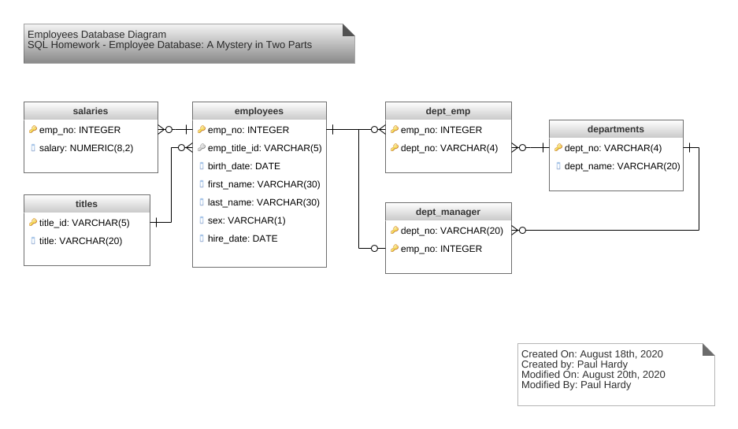

# SQL Homework - Employee Database: A Mystery in Two Parts

## Data Modeling

After a thorough inspection of the six csv files, the relationships became clear.  As part of this data modeling exercise,
the data in each csv file was examined to determine the individual column names, data type, and the uniqueness of data in each file.

This information was used to develop an ERD of the 6 entities, with attributes, and the relationships between the entities.

The ERD of the Employee database appears here:

A note on PRIMARY KEYS & FOREIGN KEYS:
    
    1. The **employees**, **salaries**, **titles**, and **departments** tables each had a single column as their primary key.  
    
    2. The **dept_emp** table facilitates the many-to-many relationship between employees and departments and performs the role of junction table, has a composite key consisting of both the emp_no and dept_no.  This ensures the relationship between the two master tables (employees and departents) is correctly represented.
    
    3. The **dept_manager** table facilitates the many-to-many relationship between departments and employees who are managers and performs the role of junction table, has a composite key consisting of both the emp_no and dept_no.  In this case, after careful analysis of the data, it was evident that departments can have multiple employees as managers, but the same employess do not appear across multiple departments. Therefor the relationship from departments to dept_manager is one to many, but the relationship from employees to dept_manager is one-to-one and UNIQUE.