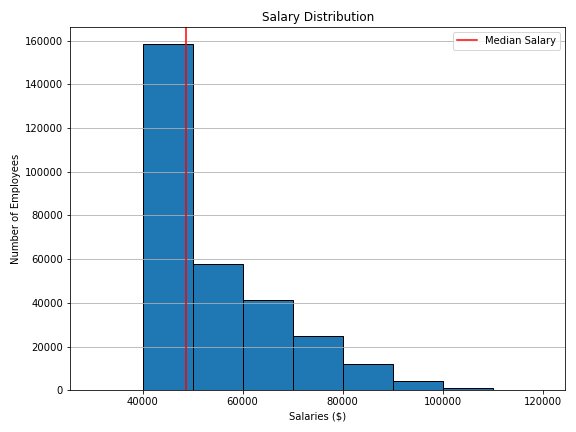
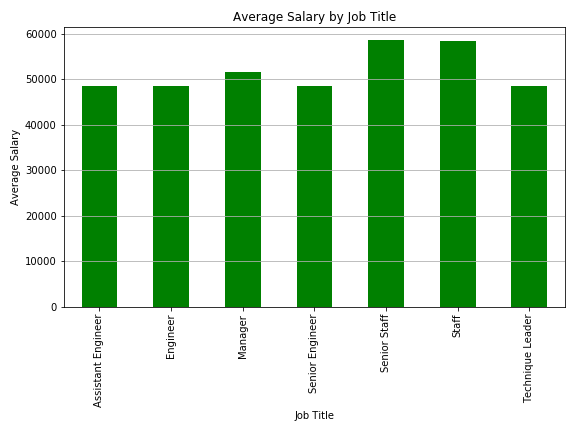

# SQL Homework - Employee Database: A Mystery in Two Parts

## Data Modeling

After a thorough inspection of the six csv files, the relationships became clear.  As part of this data modeling exercise,
the data in each csv file was examined to determine the individual column names, data type, and the uniqueness of data in each file.

This information was used to develop an ERD of the 6 entities, with attributes, and the relationships between the entities.

The ERD of the Employee database appears here:

### A note on PRIMARY KEYS & FOREIGN KEYS:
    
1. The **employees**, **salaries**, **titles**, and **departments** tables each had a single column as their primary key.  

2. The **dept_emp** table facilitates the many-to-many relationship between employees and departments and performs the role of junction table, has a composite key consisting of both the emp_no and dept_no.  This ensures the relationship between the two master tables (employees and departents) is correctly represented.
   
3. The **dept_manager** table facilitates the many-to-many relationship between departments and employees who are managers and performs the role of junction table, has a composite key consisting of both the emp_no and dept_no.  In this case, after careful analysis of the data, it was evident that departments can have multiple employees as managers, but the same employess do not appear across multiple departments. Therefor the relationship from departments to dept_manager is one to many, but the relationship from employees to dept_manager is one-to-one and UNIQUE.

### Schema Generation and Loading data into the DB:

Using GenMyModel's SQL generator for PostreSQL, the SQl code to define the tables, columns, and their relationships was generated and checked for completeness and accuracy, before being exported and prepared for use in the pgAdmin tool.  

The schema.sql file can be found in the sql subfolder here: 
[Schema](EmployeeSQL/sql/schema.sql)

1. A database was created name Employees
2. The schema script was run to create the tables, their columns, and all foreign key constraints.
3. Finally, each of the 6 tables were loaded using the import data feature within pgAdmin.  
    * The delimiter in each case was set to ",".
    * The import process was configured to account for the headers that each csv file contained.
    * As each table was loaded a SELECT count(*) FROM table name was executed to verify that all data was successfully loaded.

### Data Analysis:
With the database fully loaded, the data analysis was completed using the queries that appear in the DataAnalys.sql file in the sql subfolder. 
A link to the sql file containing the SELECT statements and the questions the code answers can be found here: [DataAnalysis](EmployeeSQL/sql/DataAnalysis.sql)

### Bonus Analysis:

The relavent database tables were imported into pandas dataframes and a histogram and barchart were generated.  Links to all of these objects appear below:

1.  Jupyter Notebook with all code to import, clean, and generate the plots: [Jupyter Notebook](EmployeeSQL/BonusAnalysis.ipynb)
2.  Histogram of Salaries for the employee database:  
    * The plot revealed the highest number of employess had salaries between 40,000 and 50,000, with decreasing numbers of employees in each subsequent range.
    * The Mean Salary is: $52,970.73
    * The Median Salary is: $48,681.00, a line was drawn on the plot to indicate the Median Salary.
3.  A bar chart of Average Salary by Title: 
    * This chart revealed that the average salary for all titles was within the high 40,000 to low 50,000 range, with the exception of titles that contained "Staff", where the average salary was in the high 50,000 range.

____________________________________________________________________________________________________________________________

